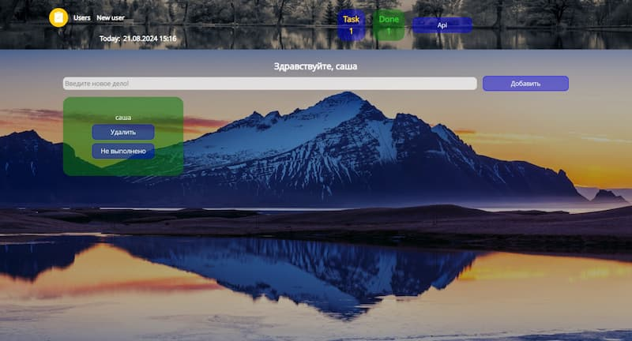

# ToDo

ToDo — это простое и удобное приложение для управления списком задач. Оно позволяет пользователям добавлять, удалять и отмечать задачи как выполненные. Приложение поддерживает создание нескольких пользователей, что позволяет каждому вести свой собственный список дел.

## Содержание
- [Особенности](#особенности)
- [Установка и Запуск](#установка-и-запуск)
- [Использование](#использование)
- [Скриншоты](#скриншоты)

## Особенности

- **Добавление задач:** Создавайте новые задачи с описанием.
- **Удаление задач:** Удаляйте ненужные или выполненные задачи.
- **Отметка как выполненное:** Отмечайте задачи как выполненные для отслеживания прогресса.
- **Поддержка пользователей:** Создавайте и управляйте несколькими пользователями.

## Установка и Запуск

Чтобы установить и запустить проект локально, выполните следующие шаги:

1. Клонируйте репозиторий:
   ```bash
   git clone https://github.com/AlexanderCherentcov/Affairs.git

2. Перейдите в директорию проекта:
   ```bash
   cd Affairs

3. Перейдите в директорию todo-server и запустите сервер:
   ```bash
   cd todo-server
   node index
 
4. В новом терминале перейдите в директорию проекта:
   ```bash
   cd Affairs

5. Перейдите в директорию todo, установите все зависимости и запустите сборку:
   ```bash
   cd todo
   npm install
   npm run dev

После выполнения этих шагов приложение будет доступно для использования.

Использование
Приложение предоставляет интерфейс для управления списком дел. Вы можете создать нового пользователя, добавить задачи, отмечать их как выполненные или удалять по мере необходимости.

Скриншоты
Главный экран приложения ToDo.



